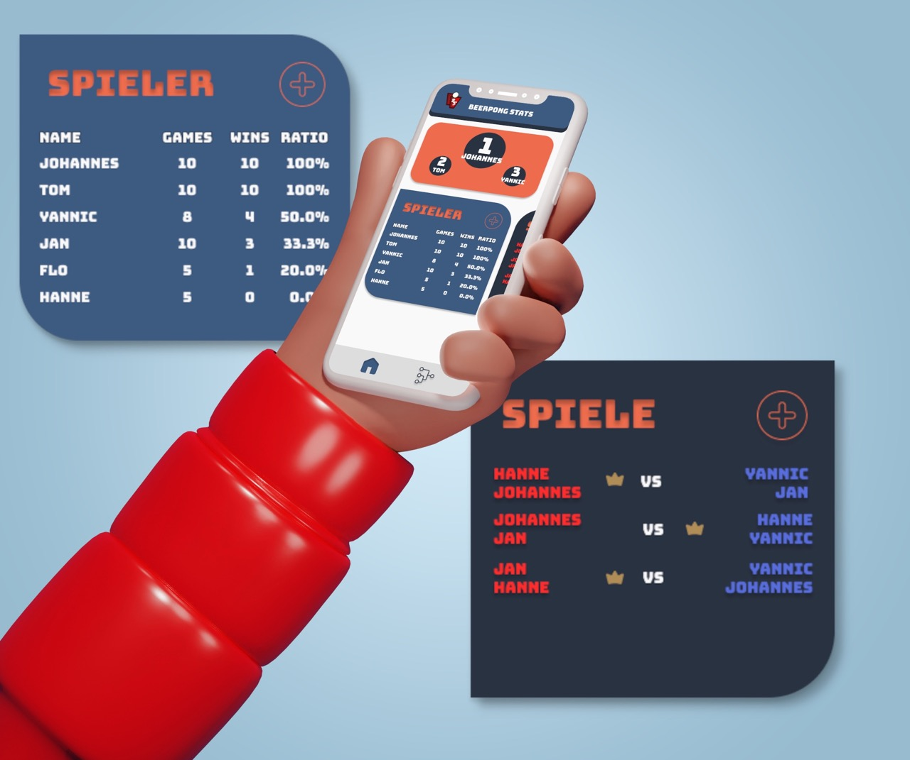

# :video_game: Beepong-Stats

### :warning: Disclaimer

> I am currently migrating from Ionic to ReactJS

> Please note that this project is currently in construction and that future releases of Beepong-Stats will be completely web-based. \
> :heavy_exclamation_mark: The previous React Native App can be found [here](https://github.com/ITegs/beerpong-stats/tree/alpha)!

---

#### Beepong-Stats is a comprehensive solution for tracking and analyzing beer pong data. Whether you're a casual player or a seasoned pro, Beepong-Stats has everything you need to take your game to the next level. With this tool, you can keep track of players and rounds, analyze game statistics, and even generate random tournaments.

### :bulb: Features

User-friendly interface for tracking beer pong game data
Ability to analyze and visualize beer pong game statistics
Support for multiple players and games
Random tournament generator for added excitement and challenge
Secure storage of beer pong data

### :bar_chart: Statistics

Beepong-Stats provides you with a wealth of statistical information about your beer pong games. You can view detailed statistics on players, games, and rounds, including win/loss records, average scores, and much more. This information can help you identify your strengths and weaknesses, as well as those of your opponents, and make informed decisions to improve your game.

### :trophy: Tournaments

The random tournament generator in Beepong-Stats makes it easy to add some excitement and challenge to your beer pong games. With a few clicks, you can generate a customized tournament, complete with pairings and schedules, and see how you and your opponents stack up against each other.

### :pencil2: Feedback

Your feedback and suggestions will be invaluable in this process. I welcome any feedback, suggestions, or ideas you may have about the project. Your input will help me make the app even better in the future.
